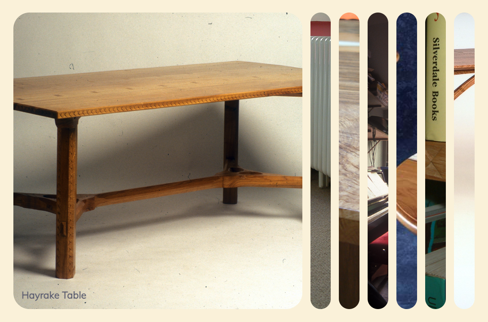

# Furniture Porfolio (expanding) for extended CV information

This is a quick adaptation of the Expanding Cards project from the Udemy course [50 Projects in 50 Days - HTML, CSS & JavaScript](https://www.udemy.com/course/50-projects-50-days/) by Brad Traversy and Florin Pop.

Exapanding Cards is the first project in the course. It is a simple project that uses HTML, CSS and JavaScript to create a page with five cards that expand when clicked. The cards are arranged in a row and the page is responsive.

I found the project quite inspirational despite being fairly simple. It is a good example of how a few lines of JavaScript can be used to create a simple but effective user interface.

The project has been adapted to use local images, have much narrower borders and use custom colours.

The project is a temporary measure to be used as a small part of a large project to showcase past achievements and interests to be linked with my PDF CV as well as my [GitHub CV](https://github.com/pablisch/CV).

## Getting Started

1. Clone the repository to your local machine.
2. Run `open index.html` from the project directory to open the page in your browser.

## View live website

This project is hosted on GitHub Pages. You can view it [here](https://pablisch.github.io/furniture-portfolio-expanding/).

## Screenshot

